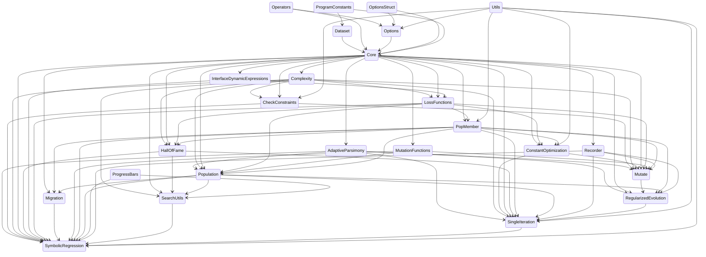

<div align="center">

SymbolicRegression.jl searches for symbolic expressions which optimize a particular objective.

https://github.com/MilesCranmer/SymbolicRegression.jl/assets/7593028/f5b68f1f-9830-497f-a197-6ae332c94ee0

| Latest release | Documentation | Forums | Paper |
| :---: | :---: | :---: | :---: |
| [](https://juliahub.com/ui/Packages/SymbolicRegression/X2eIS) | [](https://astroautomata.com/SymbolicRegression.jl/dev/) | [](https://github.com/MilesCranmer/PySR/discussions) | [](https://arxiv.org/abs/2305.01582) |

| Build status | Coverage |
| :---: | :---: |
| [](.github/workflows/CI.yml) | [](https://coveralls.io/github/MilesCranmer/SymbolicRegression.jl?branch=master)<br>[](https://github.com/JuliaTesting/Aqua.jl) |


Check out [PySR](https://github.com/MilesCranmer/PySR) for
a Python frontend.
[Cite this software](https://arxiv.org/abs/2305.01582)

</div>

**Contents**:

- [Contributors](#contributors-)
- [Quickstart](#quickstart)
    - [MLJ Interface](#mlj-interface)
    - [Low-Level Interface](#low-level-interface)
- [→ Documentation](https://astroautomata.com/SymbolicRegression.jl)

<div align="center">

### Contributors ✨

</div>

We are eager to welcome new contributors!
If you have an idea for a new feature, don't hesitate to share it on the [issues](https://github.com/MilesCranmer/SymbolicRegression.jl/issues) page or [forums](https://github.com/MilesCranmer/PySR/discussions).

<!-- ALL-CONTRIBUTORS-LIST:START - Do not remove or modify this section -->
<!-- prettier-ignore-start -->
<!-- markdownlint-disable -->
<table>
  <tbody>
    <tr>
      <td align="center" valign="top" width="12.5%"><a href="https://www.linkedin.com/in/markkittisopikul/"><br /><sub><b>Mark Kittisopikul</b></sub></a><br /><a href="https://github.com/MilesCranmer/SymbolicRegression.jl/commits?author=mkitti" title="Code">💻</a> <a href="#ideas-mkitti" title="Ideas, planning, and feedback.">💡</a> <a href="#infra-mkitti" title="Infrastructure (Hosting, Build-Tools, etc)">🚇</a> <a href="#platform-mkitti" title="Packaging/porting to new platform">📦</a> <a href="#promotion-mkitti" title="Promotion">📣</a> <a href="https://github.com/MilesCranmer/SymbolicRegression.jl/pulls?q=is%3Apr+reviewed-by%3Amkitti" title="Reviewed Pull Requests">👀</a> <a href="#tool-mkitti" title="Tools">🔧</a> <a href="https://github.com/MilesCranmer/SymbolicRegression.jl/commits?author=mkitti" title="Tests">⚠️</a></td>
      <td align="center" valign="top" width="12.5%"><a href="https://github.com/tttc3"><br /><sub><b>T Coxon</b></sub></a><br /><a href="https://github.com/MilesCranmer/SymbolicRegression.jl/issues?q=author%3Atttc3" title="Bug reports">🐛</a> <a href="https://github.com/MilesCranmer/SymbolicRegression.jl/commits?author=tttc3" title="Code">💻</a> <a href="#plugin-tttc3" title="Plugin/utility libraries">🔌</a> <a href="#ideas-tttc3" title="Ideas, planning, and feedback.">💡</a> <a href="#infra-tttc3" title="Infrastructure (Hosting, Build-Tools, etc)">🚇</a> <a href="#maintenance-tttc3" title="Maintenance">🚧</a> <a href="https://github.com/MilesCranmer/SymbolicRegression.jl/pulls?q=is%3Apr+reviewed-by%3Atttc3" title="Reviewed Pull Requests">👀</a> <a href="#tool-tttc3" title="Tools">🔧</a> <a href="https://github.com/MilesCranmer/SymbolicRegression.jl/commits?author=tttc3" title="Tests">⚠️</a> <a href="#userTesting-tttc3" title="User Testing">📓</a></td>
      <td align="center" valign="top" width="12.5%"><a href="https://github.com/DhananjayAshok"><br /><sub><b>Dhananjay Ashok</b></sub></a><br /><a href="https://github.com/MilesCranmer/SymbolicRegression.jl/commits?author=DhananjayAshok" title="Code">💻</a> <a href="#example-DhananjayAshok" title="Examples.">🌍</a> <a href="#ideas-DhananjayAshok" title="Ideas, planning, and feedback.">💡</a> <a href="#maintenance-DhananjayAshok" title="Maintenance">🚧</a> <a href="https://github.com/MilesCranmer/SymbolicRegression.jl/commits?author=DhananjayAshok" title="Tests">⚠️</a></td>
      <td align="center" valign="top" width="12.5%"><a href="https://gitlab.com/johanbluecreek"><br /><sub><b>Johan Blåbäck</b></sub></a><br /><a href="https://github.com/MilesCranmer/SymbolicRegression.jl/issues?q=author%3Ajohanbluecreek" title="Bug reports">🐛</a> <a href="https://github.com/MilesCranmer/SymbolicRegression.jl/commits?author=johanbluecreek" title="Code">💻</a> <a href="#ideas-johanbluecreek" title="Ideas, planning, and feedback.">💡</a> <a href="#maintenance-johanbluecreek" title="Maintenance">🚧</a> <a href="#promotion-johanbluecreek" title="Promotion">📣</a> <a href="https://github.com/MilesCranmer/SymbolicRegression.jl/pulls?q=is%3Apr+reviewed-by%3Ajohanbluecreek" title="Reviewed Pull Requests">👀</a> <a href="https://github.com/MilesCranmer/SymbolicRegression.jl/commits?author=johanbluecreek" title="Tests">⚠️</a> <a href="#userTesting-johanbluecreek" title="User Testing">📓</a></td>
      <td align="center" valign="top" width="12.5%"><a href="https://mathopt.de/people/martensen/index.php"><br /><sub><b>JuliusMartensen</b></sub></a><br /><a href="https://github.com/MilesCranmer/SymbolicRegression.jl/issues?q=author%3AAlCap23" title="Bug reports">🐛</a> <a href="https://github.com/MilesCranmer/SymbolicRegression.jl/commits?author=AlCap23" title="Code">💻</a> <a href="https://github.com/MilesCranmer/SymbolicRegression.jl/commits?author=AlCap23" title="Documentation">📖</a> <a href="#plugin-AlCap23" title="Plugin/utility libraries">🔌</a> <a href="#ideas-AlCap23" title="Ideas, planning, and feedback.">💡</a> <a href="#infra-AlCap23" title="Infrastructure (Hosting, Build-Tools, etc)">🚇</a> <a href="#maintenance-AlCap23" title="Maintenance">🚧</a> <a href="#platform-AlCap23" title="Packaging/porting to new platform">📦</a> <a href="#promotion-AlCap23" title="Promotion">📣</a> <a href="https://github.com/MilesCranmer/SymbolicRegression.jl/pulls?q=is%3Apr+reviewed-by%3AAlCap23" title="Reviewed Pull Requests">👀</a> <a href="#tool-AlCap23" title="Tools">🔧</a> <a href="#userTesting-AlCap23" title="User Testing">📓</a></td>
      <td align="center" valign="top" width="12.5%"><a href="https://github.com/ngam"><br /><sub><b>ngam</b></sub></a><br /><a href="https://github.com/MilesCranmer/SymbolicRegression.jl/commits?author=ngam" title="Code">💻</a> <a href="#infra-ngam" title="Infrastructure (Hosting, Build-Tools, etc)">🚇</a> <a href="#platform-ngam" title="Packaging/porting to new platform">📦</a> <a href="https://github.com/MilesCranmer/SymbolicRegression.jl/pulls?q=is%3Apr+reviewed-by%3Angam" title="Reviewed Pull Requests">👀</a> <a href="#tool-ngam" title="Tools">🔧</a> <a href="https://github.com/MilesCranmer/SymbolicRegression.jl/commits?author=ngam" title="Tests">⚠️</a></td>
      <td align="center" valign="top" width="12.5%"><a href="https://github.com/kazewong"><br /><sub><b>Kaze Wong</b></sub></a><br /><a href="https://github.com/MilesCranmer/SymbolicRegression.jl/issues?q=author%3Akazewong" title="Bug reports">🐛</a> <a href="https://github.com/MilesCranmer/SymbolicRegression.jl/commits?author=kazewong" title="Code">💻</a> <a href="#ideas-kazewong" title="Ideas, planning, and feedback.">💡</a> <a href="#infra-kazewong" title="Infrastructure (Hosting, Build-Tools, etc)">🚇</a> <a href="#maintenance-kazewong" title="Maintenance">🚧</a> <a href="#promotion-kazewong" title="Promotion">📣</a> <a href="https://github.com/MilesCranmer/SymbolicRegression.jl/pulls?q=is%3Apr+reviewed-by%3Akazewong" title="Reviewed Pull Requests">👀</a> <a href="#research-kazewong" title="Research">🔬</a> <a href="#userTesting-kazewong" title="User Testing">📓</a></td>
      <td align="center" valign="top" width="12.5%"><a href="https://github.com/ChrisRackauckas"><br /><sub><b>Christopher Rackauckas</b></sub></a><br /><a href="https://github.com/MilesCranmer/SymbolicRegression.jl/issues?q=author%3AChrisRackauckas" title="Bug reports">🐛</a> <a href="https://github.com/MilesCranmer/SymbolicRegression.jl/commits?author=ChrisRackauckas" title="Code">💻</a> <a href="#plugin-ChrisRackauckas" title="Plugin/utility libraries">🔌</a> <a href="#ideas-ChrisRackauckas" title="Ideas, planning, and feedback.">💡</a> <a href="#infra-ChrisRackauckas" title="Infrastructure (Hosting, Build-Tools, etc)">🚇</a> <a href="#promotion-ChrisRackauckas" title="Promotion">📣</a> <a href="https://github.com/MilesCranmer/SymbolicRegression.jl/pulls?q=is%3Apr+reviewed-by%3AChrisRackauckas" title="Reviewed Pull Requests">👀</a> <a href="#research-ChrisRackauckas" title="Research">🔬</a> <a href="#tool-ChrisRackauckas" title="Tools">🔧</a> <a href="https://github.com/MilesCranmer/SymbolicRegression.jl/commits?author=ChrisRackauckas" title="Tests">⚠️</a> <a href="#userTesting-ChrisRackauckas" title="User Testing">📓</a></td>
    </tr>
    <tr>
      <td align="center" valign="top" width="12.5%"><a href="https://kidger.site/"><br /><sub><b>Patrick Kidger</b></sub></a><br /><a href="https://github.com/MilesCranmer/SymbolicRegression.jl/issues?q=author%3Apatrick-kidger" title="Bug reports">🐛</a> <a href="https://github.com/MilesCranmer/SymbolicRegression.jl/commits?author=patrick-kidger" title="Code">💻</a> <a href="https://github.com/MilesCranmer/SymbolicRegression.jl/commits?author=patrick-kidger" title="Documentation">📖</a> <a href="#plugin-patrick-kidger" title="Plugin/utility libraries">🔌</a> <a href="#ideas-patrick-kidger" title="Ideas, planning, and feedback.">💡</a> <a href="#maintenance-patrick-kidger" title="Maintenance">🚧</a> <a href="#promotion-patrick-kidger" title="Promotion">📣</a> <a href="https://github.com/MilesCranmer/SymbolicRegression.jl/pulls?q=is%3Apr+reviewed-by%3Apatrick-kidger" title="Reviewed Pull Requests">👀</a> <a href="#research-patrick-kidger" title="Research">🔬</a> <a href="#tool-patrick-kidger" title="Tools">🔧</a> <a href="https://github.com/MilesCranmer/SymbolicRegression.jl/commits?author=patrick-kidger" title="Tests">⚠️</a> <a href="#userTesting-patrick-kidger" title="User Testing">📓</a></td>
      <td align="center" valign="top" width="12.5%"><a href="https://github.com/OkonSamuel"><br /><sub><b>Okon Samuel</b></sub></a><br /><a href="https://github.com/MilesCranmer/SymbolicRegression.jl/issues?q=author%3AOkonSamuel" title="Bug reports">🐛</a> <a href="https://github.com/MilesCranmer/SymbolicRegression.jl/commits?author=OkonSamuel" title="Code">💻</a> <a href="https://github.com/MilesCranmer/SymbolicRegression.jl/commits?author=OkonSamuel" title="Documentation">📖</a> <a href="#maintenance-OkonSamuel" title="Maintenance">🚧</a> <a href="#ideas-OkonSamuel" title="Ideas, planning, and feedback.">💡</a> <a href="#infra-OkonSamuel" title="Infrastructure (Hosting, Build-Tools, etc)">🚇</a> <a href="https://github.com/MilesCranmer/SymbolicRegression.jl/pulls?q=is%3Apr+reviewed-by%3AOkonSamuel" title="Reviewed Pull Requests">👀</a> <a href="https://github.com/MilesCranmer/SymbolicRegression.jl/commits?author=OkonSamuel" title="Tests">⚠️</a> <a href="#userTesting-OkonSamuel" title="User Testing">📓</a></td>
      <td align="center" valign="top" width="12.5%"><a href="https://github.com/w2ll2am"><br /><sub><b>William Booth-Clibborn</b></sub></a><br /><a href="https://github.com/MilesCranmer/SymbolicRegression.jl/commits?author=w2ll2am" title="Code">💻</a> <a href="#example-w2ll2am" title="Examples.">🌍</a> <a href="https://github.com/MilesCranmer/SymbolicRegression.jl/commits?author=w2ll2am" title="Documentation">📖</a> <a href="#userTesting-w2ll2am" title="User Testing">📓</a> <a href="#maintenance-w2ll2am" title="Maintenance">🚧</a> <a href="https://github.com/MilesCranmer/SymbolicRegression.jl/pulls?q=is%3Apr+reviewed-by%3Aw2ll2am" title="Reviewed Pull Requests">👀</a> <a href="#tool-w2ll2am" title="Tools">🔧</a> <a href="https://github.com/MilesCranmer/SymbolicRegression.jl/commits?author=w2ll2am" title="Tests">⚠️</a></td>
      <td align="center" valign="top" width="12.5%"><a href="https://pablo-lemos.github.io/"><br /><sub><b>Pablo Lemos</b></sub></a><br /><a href="https://github.com/MilesCranmer/SymbolicRegression.jl/issues?q=author%3APablo-Lemos" title="Bug reports">🐛</a> <a href="#ideas-Pablo-Lemos" title="Ideas, planning, and feedback.">💡</a> <a href="#promotion-Pablo-Lemos" title="Promotion">📣</a> <a href="https://github.com/MilesCranmer/SymbolicRegression.jl/pulls?q=is%3Apr+reviewed-by%3APablo-Lemos" title="Reviewed Pull Requests">👀</a> <a href="#research-Pablo-Lemos" title="Research">🔬</a> <a href="#userTesting-Pablo-Lemos" title="User Testing">📓</a></td>
      <td align="center" valign="top" width="12.5%"><a href="https://github.com/Moelf"><br /><sub><b>Jerry Ling</b></sub></a><br /><a href="https://github.com/MilesCranmer/SymbolicRegression.jl/issues?q=author%3AMoelf" title="Bug reports">🐛</a> <a href="https://github.com/MilesCranmer/SymbolicRegression.jl/commits?author=Moelf" title="Code">💻</a> <a href="https://github.com/MilesCranmer/SymbolicRegression.jl/commits?author=Moelf" title="Documentation">📖</a> <a href="#example-Moelf" title="Examples.">🌍</a> <a href="#ideas-Moelf" title="Ideas, planning, and feedback.">💡</a> <a href="#promotion-Moelf" title="Promotion">📣</a> <a href="https://github.com/MilesCranmer/SymbolicRegression.jl/pulls?q=is%3Apr+reviewed-by%3AMoelf" title="Reviewed Pull Requests">👀</a> <a href="#userTesting-Moelf" title="User Testing">📓</a></td>
      <td align="center" valign="top" width="12.5%"><a href="https://github.com/CharFox1"><br /><sub><b>Charles Fox</b></sub></a><br /><a href="https://github.com/MilesCranmer/SymbolicRegression.jl/issues?q=author%3ACharFox1" title="Bug reports">🐛</a> <a href="https://github.com/MilesCranmer/SymbolicRegression.jl/commits?author=CharFox1" title="Code">💻</a> <a href="#ideas-CharFox1" title="Ideas, planning, and feedback.">💡</a> <a href="#maintenance-CharFox1" title="Maintenance">🚧</a> <a href="#promotion-CharFox1" title="Promotion">📣</a> <a href="https://github.com/MilesCranmer/SymbolicRegression.jl/pulls?q=is%3Apr+reviewed-by%3ACharFox1" title="Reviewed Pull Requests">👀</a> <a href="#research-CharFox1" title="Research">🔬</a> <a href="#userTesting-CharFox1" title="User Testing">📓</a></td>
      <td align="center" valign="top" width="12.5%"><a href="https://github.com/johannbrehmer"><br /><sub><b>Johann Brehmer</b></sub></a><br /><a href="https://github.com/MilesCranmer/SymbolicRegression.jl/commits?author=johannbrehmer" title="Code">💻</a> <a href="https://github.com/MilesCranmer/SymbolicRegression.jl/commits?author=johannbrehmer" title="Documentation">📖</a> <a href="#ideas-johannbrehmer" title="Ideas, planning, and feedback.">💡</a> <a href="#promotion-johannbrehmer" title="Promotion">📣</a> <a href="https://github.com/MilesCranmer/SymbolicRegression.jl/pulls?q=is%3Apr+reviewed-by%3Ajohannbrehmer" title="Reviewed Pull Requests">👀</a> <a href="#research-johannbrehmer" title="Research">🔬</a> <a href="https://github.com/MilesCranmer/SymbolicRegression.jl/commits?author=johannbrehmer" title="Tests">⚠️</a> <a href="#userTesting-johannbrehmer" title="User Testing">📓</a></td>
      <td align="center" valign="top" width="12.5%"><a href="http://www.cosmicmar.com/"><br /><sub><b>Marius Millea</b></sub></a><br /><a href="https://github.com/MilesCranmer/SymbolicRegression.jl/commits?author=marius311" title="Code">💻</a> <a href="#ideas-marius311" title="Ideas, planning, and feedback.">💡</a> <a href="#promotion-marius311" title="Promotion">📣</a> <a href="https://github.com/MilesCranmer/SymbolicRegression.jl/pulls?q=is%3Apr+reviewed-by%3Amarius311" title="Reviewed Pull Requests">👀</a> <a href="#userTesting-marius311" title="User Testing">📓</a></td>
    </tr>
    <tr>
      <td align="center" valign="top" width="12.5%"><a href="https://gitlab.com/cobac"><br /><sub><b>Coba</b></sub></a><br /><a href="https://github.com/MilesCranmer/SymbolicRegression.jl/issues?q=author%3Acobac" title="Bug reports">🐛</a> <a href="https://github.com/MilesCranmer/SymbolicRegression.jl/commits?author=cobac" title="Code">💻</a> <a href="#ideas-cobac" title="Ideas, planning, and feedback.">💡</a> <a href="https://github.com/MilesCranmer/SymbolicRegression.jl/pulls?q=is%3Apr+reviewed-by%3Acobac" title="Reviewed Pull Requests">👀</a> <a href="#userTesting-cobac" title="User Testing">📓</a></td>
      <td align="center" valign="top" width="12.5%"><a href="https://github.com/pitmonticone"><br /><sub><b>Pietro Monticone</b></sub></a><br /><a href="https://github.com/MilesCranmer/SymbolicRegression.jl/issues?q=author%3Apitmonticone" title="Bug reports">🐛</a> <a href="https://github.com/MilesCranmer/SymbolicRegression.jl/commits?author=pitmonticone" title="Documentation">📖</a> <a href="#ideas-pitmonticone" title="Ideas, planning, and feedback.">💡</a></td>
      <td align="center" valign="top" width="12.5%"><a href="https://github.com/sheevy"><br /><sub><b>Mateusz Kubica</b></sub></a><br /><a href="https://github.com/MilesCranmer/SymbolicRegression.jl/commits?author=sheevy" title="Documentation">📖</a> <a href="#ideas-sheevy" title="Ideas, planning, and feedback.">💡</a></td>
      <td align="center" valign="top" width="12.5%"><a href="https://jaywadekar.github.io/"><br /><sub><b>Jay Wadekar</b></sub></a><br /><a href="https://github.com/MilesCranmer/SymbolicRegression.jl/issues?q=author%3AJayWadekar" title="Bug reports">🐛</a> <a href="#ideas-JayWadekar" title="Ideas, planning, and feedback.">💡</a> <a href="#promotion-JayWadekar" title="Promotion">📣</a> <a href="#research-JayWadekar" title="Research">🔬</a></td>
      <td align="center" valign="top" width="12.5%"><a href="https://github.com/ablaom"><br /><sub><b>Anthony Blaom, PhD</b></sub></a><br /><a href="#infra-ablaom" title="Infrastructure (Hosting, Build-Tools, etc)">🚇</a> <a href="#ideas-ablaom" title="Ideas, planning, and feedback.">💡</a> <a href="https://github.com/MilesCranmer/SymbolicRegression.jl/pulls?q=is%3Apr+reviewed-by%3Aablaom" title="Reviewed Pull Requests">👀</a></td>
      <td align="center" valign="top" width="12.5%"><a href="https://github.com/Jgmedina95"><br /><sub><b>Jgmedina95</b></sub></a><br /><a href="https://github.com/MilesCranmer/SymbolicRegression.jl/issues?q=author%3AJgmedina95" title="Bug reports">🐛</a> <a href="#ideas-Jgmedina95" title="Ideas, planning, and feedback.">💡</a> <a href="https://github.com/MilesCranmer/SymbolicRegression.jl/pulls?q=is%3Apr+reviewed-by%3AJgmedina95" title="Reviewed Pull Requests">👀</a></td>
      <td align="center" valign="top" width="12.5%"><a href="https://github.com/mcabbott"><br /><sub><b>Michael Abbott</b></sub></a><br /><a href="https://github.com/MilesCranmer/SymbolicRegression.jl/commits?author=mcabbott" title="Code">💻</a> <a href="#ideas-mcabbott" title="Ideas, planning, and feedback.">💡</a> <a href="https://github.com/MilesCranmer/SymbolicRegression.jl/pulls?q=is%3Apr+reviewed-by%3Amcabbott" title="Reviewed Pull Requests">👀</a> <a href="#tool-mcabbott" title="Tools">🔧</a></td>
      <td align="center" valign="top" width="12.5%"><a href="https://github.com/oscardssmith"><br /><sub><b>Oscar Smith</b></sub></a><br /><a href="https://github.com/MilesCranmer/SymbolicRegression.jl/commits?author=oscardssmith" title="Code">💻</a> <a href="#ideas-oscardssmith" title="Ideas, planning, and feedback.">💡</a></td>
    </tr>
    <tr>
      <td align="center" valign="top" width="12.5%"><a href="https://ericphanson.com/"><br /><sub><b>Eric Hanson</b></sub></a><br /><a href="#ideas-ericphanson" title="Ideas, planning, and feedback.">💡</a> <a href="#promotion-ericphanson" title="Promotion">📣</a> <a href="#userTesting-ericphanson" title="User Testing">📓</a></td>
      <td align="center" valign="top" width="12.5%"><a href="https://github.com/henriquebecker91"><br /><sub><b>Henrique Becker</b></sub></a><br /><a href="https://github.com/MilesCranmer/SymbolicRegression.jl/commits?author=henriquebecker91" title="Code">💻</a> <a href="#ideas-henriquebecker91" title="Ideas, planning, and feedback.">💡</a> <a href="https://github.com/MilesCranmer/SymbolicRegression.jl/pulls?q=is%3Apr+reviewed-by%3Ahenriquebecker91" title="Reviewed Pull Requests">👀</a></td>
      <td align="center" valign="top" width="12.5%"><a href="https://github.com/qwertyjl"><br /><sub><b>qwertyjl</b></sub></a><br /><a href="https://github.com/MilesCranmer/SymbolicRegression.jl/issues?q=author%3Aqwertyjl" title="Bug reports">🐛</a> <a href="https://github.com/MilesCranmer/SymbolicRegression.jl/commits?author=qwertyjl" title="Documentation">📖</a> <a href="#ideas-qwertyjl" title="Ideas, planning, and feedback.">💡</a> <a href="#userTesting-qwertyjl" title="User Testing">📓</a></td>
      <td align="center" valign="top" width="12.5%"><a href="https://huijzer.xyz/"><br /><sub><b>Rik Huijzer</b></sub></a><br /><a href="#ideas-rikhuijzer" title="Ideas, planning, and feedback.">💡</a> <a href="#infra-rikhuijzer" title="Infrastructure (Hosting, Build-Tools, etc)">🚇</a></td>
      <td align="center" valign="top" width="12.5%"><a href="https://github.com/GCaptainNemo"><br /><sub><b>Hongyu Wang</b></sub></a><br /><a href="#ideas-GCaptainNemo" title="Ideas, planning, and feedback.">💡</a> <a href="#promotion-GCaptainNemo" title="Promotion">📣</a> <a href="#research-GCaptainNemo" title="Research">🔬</a></td>
      <td align="center" valign="top" width="12.5%"><a href="https://sauravmaheshkar.github.io/"><br /><sub><b>Saurav Maheshkar</b></sub></a><br /><a href="#tool-SauravMaheshkar" title="Tools">🔧</a></td>
    </tr>
  </tbody>
</table>

<!-- markdownlint-restore -->
<!-- prettier-ignore-end -->

<!-- ALL-CONTRIBUTORS-LIST:END -->

## Quickstart

Install in Julia with:
```julia
using Pkg
Pkg.add("SymbolicRegression")
```

### MLJ Interface

The easiest way to use SymbolicRegression.jl
is with [MLJ](https://github.com/alan-turing-institute/MLJ.jl).
Let's see an example:

```julia
import SymbolicRegression: SRRegressor
import MLJ: machine, fit!, predict, report

# Dataset with two named features:
X = (a = rand(500), b = rand(500))

# and one target:
y = @. 2 * cos(X.a * 23.5) - X.b ^ 2 

# with some noise:
y = y .+ randn(500) .* 1e-3

model = SRRegressor(
    niterations=50,
    binary_operators=[+, -, *],
    unary_operators=[cos],
)
```

Now, let's create and train this model
on our data:

```julia
mach = machine(model, X, y)

fit!(mach)
```

You will notice that expressions are printed
using the column names of our table. If,
instead of a table-like object,
a simple array is passed
(e.g., `X=randn(100, 2)`),
`x1, ..., xn` will be used for variable names.

Let's look at the expressions discovered:

```julia
report(mach)
```

Finally, we can make predictions with the expressions
on new data:

```julia
predict(mach, X)
```

This will make predictions using the expression
selected using the function passed to `selection_method`.
By default this selection is made a mix of accuracy and complexity.
For example, we can make predictions using expression 2 with:

```julia
mach.model.selection_method = Returns(2)
predict(mach, X)
```

For fitting multiple outputs, one can use `MultitargetSRRegressor`.
For a full list of options available to each regressor, see the [API page](https://astroautomata.com/SymbolicRegression.jl/dev/api/).

### Low-Level Interface

The heart of SymbolicRegression.jl is the
`equation_search` function.
This takes a 2D array and attempts
to model a 1D array using analytic functional forms.
**Note:** unlike the MLJ interface,
this assumes column-major input of shape [features, rows].

```julia
import SymbolicRegression: Options, equation_search

X = randn(2, 100)
y = 2 * cos.(X[2, :]) + X[1, :] .^ 2 .- 2

options = Options(
    binary_operators=[+, *, /, -],
    unary_operators=[cos, exp],
    populations=20
)

hall_of_fame = equation_search(
    X, y, niterations=40, options=options,
    parallelism=:multithreading
)
```
You can view the resultant equations in the dominating Pareto front (best expression
seen at each complexity) with:
```julia
import SymbolicRegression: calculate_pareto_frontier

dominating = calculate_pareto_frontier(hall_of_fame)
```
This is a vector of `PopMember` type - which contains the expression along with the score.
We can get the expressions with:
```julia
trees = [member.tree for member in dominating]
```
Each of these equations is a `Node{T}` type for some constant type `T` (like `Float32`).

You can evaluate a given tree with:
```julia
import SymbolicRegression: eval_tree_array

tree = trees[end]
output, did_succeed = eval_tree_array(tree, X, options)
```
The `output` array will contain the result of the tree at each of the 100 rows.
This `did_succeed` flag detects whether an evaluation was successful, or whether
encountered any NaNs or Infs during calculation (such as, e.g., `sqrt(-1)`).


## Constructing trees

You can also manipulate and construct trees directly. For example:

```julia
import SymbolicRegression: Options, Node, eval_tree_array

options = Options(;
    binary_operators=[+, -, *, ^, /], unary_operators=[cos, exp, sin]
)
x1, x2, x3 = [Node(; feature=i) for i=1:3]
tree = cos(x1 - 3.2 * x2) - x1^3.2
```
This tree has `Float64` constants, so the type of the entire tree
will be promoted to `Node{Float64}`.

We can convert all constants (recursively) to `Float32`:
```julia
float32_tree = convert(Node{Float32}, tree)
```
We can then evaluate this tree on a dataset:
```julia
X = rand(Float32, 3, 100)
output, did_succeed = eval_tree_array(tree, X, options)
```

## Exporting to SymbolicUtils.jl

We can view the equations in the dominating
Pareto frontier with:
```julia
dominating = calculate_pareto_frontier(hall_of_fame)
```
We can convert the best equation
to [SymbolicUtils.jl](https://github.com/JuliaSymbolics/SymbolicUtils.jl)
with the following function:
```julia
import SymbolicRegression: node_to_symbolic

eqn = node_to_symbolic(dominating[end].tree, options)
println(simplify(eqn*5 + 3))
```

We can also print out the full pareto frontier like so:
```julia
import SymbolicRegression: compute_complexity, string_tree

println("Complexity\tMSE\tEquation")

for member in dominating
    complexity = compute_complexity(member, options)
    loss = member.loss
    string = string_tree(member.tree, options)

    println("$(complexity)\t$(loss)\t$(string)")
end
```

## Code structure

SymbolicRegression.jl is organized roughly as follows.
Rounded rectangles indicate objects, and rectangles indicate functions.
> (if you can't see this diagram being rendered, try pasting it into [mermaid-js.github.io/mermaid-live-editor](https://mermaid-js.github.io/mermaid-live-editor))


The `HallOfFame` objects store the expressions with the lowest loss seen at each complexity.

The dependency structure of the code itself is as follows:




Bash command to generate dependency structure from `src` directory (requires `vim-stream`):
```bash
echo 'stateDiagram-v2'
IFS=$'\n'
for f in *.jl; do
    for line in $(cat $f | grep -e 'import \.\.' -e 'import \.'); do
        echo $(echo $line | vims -s 'dwf:d$' -t '%s/^\.*//g' '%s/Module//g') $(basename "$f" .jl);
    done;
done | vims -l 'f a--> ' | sort
```


## Search options

See https://astroautomata.com/SymbolicRegression.jl/stable/api/#Options

