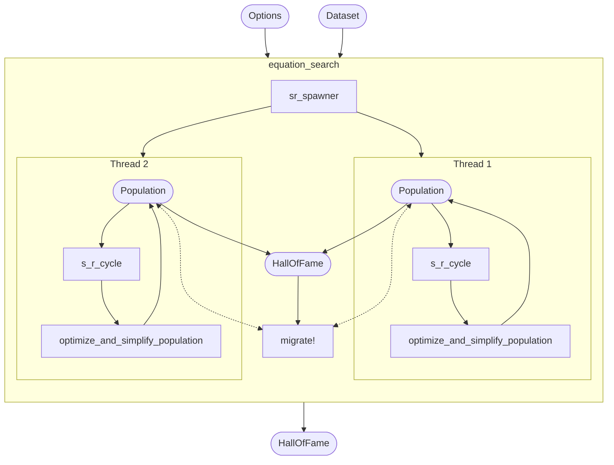
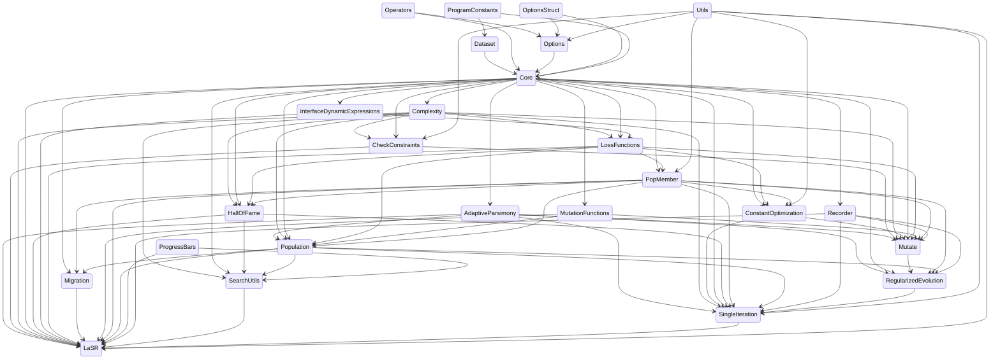

<!-- prettier-ignore-start -->
<div align="center">

LaSR.jl accelerates the search for symbolic expressions using language guidance.

| Latest release | Website | Forums | Paper |
| :---: | :---: | :---: | :---: |
| [](https://juliahub.com/ui/Packages/LaSR/X2eIS) | [](https://trishullab.github.io/lasr-web/) | [](https://github.com/trishullab/LaSR.jl/discussions) | [](https://atharvas.net/static/lasr.pdf) |

| Build status | Coverage |
| :---: | :---: |
| [](.github/workflows/CI.yml) | [](https://coveralls.io/github/trishullab/LaSR.jl?branch=master) |

LaSR is loaded into [SymbolicRegression.jl](https://github.com/MilesCranmer/SymbolicRegression.jl). Check out [PySR](https://github.com/MilesCranmer/PySR) for
a Python frontend.

[Cite this software](https://arxiv.org/abs/????.?????)

</div>
<!-- prettier-ignore-end -->

**Contents**:

- [Quickstart](#quickstart)
- [Organization](#organization)
- [LLM Utilities](#llm-utilities)

## Quickstart

Install in Julia with:

```julia
using Pkg
Pkg.add("LaSR")
```

LaSR uses the same interface as [SymbolicRegression.jl](https://github.com/MilesCranmer/SymbolicRegression.jl). The easiest way to use LaSR.jl
is with [MLJ](https://github.com/alan-turing-institute/MLJ.jl).
Let's see an example:

```julia
import LaSR: LaSRRegressor, LLMOptions
import MLJ: machine, fit!, predict, report

# Dataset with two named features:
X = (a = rand(500), b = rand(500))

# and one target:
y = @. 2 * cos(X.a * 23.5) - X.b ^ 2

# with some noise:
y = y .+ randn(500) .* 1e-3

model = LaSRRegressor(
    niterations=50,
    binary_operators=[+, -, *],
    unary_operators=[cos],
    llm_options=LLMOptions(
      ...
    )
)
```

Now, let's create and train this model
on our data:

```julia
mach = machine(model, X, y)

fit!(mach)
```

You will notice that expressions are printed
using the column names of our table. If,
instead of a table-like object,
a simple array is passed
(e.g., `X=randn(100, 2)`),
`x1, ..., xn` will be used for variable names.

Let's look at the expressions discovered:

```julia
report(mach)
```

Finally, we can make predictions with the expressions
on new data:

```julia
predict(mach, X)
```

This will make predictions using the expression
selected by `model.selection_method`,
which by default is a mix of accuracy and complexity.

You can override this selection and select an equation from
the Pareto front manually with:

```julia
predict(mach, (data=X, idx=2))
```

where here we choose to evaluate the second equation.

For fitting multiple outputs, one can use `MultitargetLaSRRegressor`
(and pass an array of indices to `idx` in `predict` for selecting specific equations).
For a full list of options available to each regressor, see the [API page](https://astroautomata.com/LaSR.jl/dev/api/).

### LLM Options

LaSR uses PromptingTools.jl for zero shot prompting. If you wish to make changes to the prompting options, you can pass an `LLMOptions` object to the `LaSRRegressor` constructor. The options available are:
```julia
llm_options = LLMOptions(
  ...
)
```


## Organization

LaSR.jl development is kept independent from the main codebase. However, to ensure LaSR can be used easily, it is integrated into SymbolicRegression.jl via the `ext/SymbolicRegressionLaSRExt` extension module. This, in turn, is loaded into PySR. The below diagram summarizes the interaction between the different packages.

## Code structure

LaSR.jl is organized roughly as follows.
Rounded rectangles indicate objects, and rectangles indicate functions.

> (if you can't see this diagram being rendered, try pasting it into [mermaid-js.github.io/mermaid-live-editor](https://mermaid-js.github.io/mermaid-live-editor))



The `HallOfFame` objects store the expressions with the lowest loss seen at each complexity.

The dependency structure of the code itself is as follows:



Bash command to generate dependency structure from `src` directory (requires `vim-stream`):

```bash
echo 'stateDiagram-v2'
IFS=$'\n'
for f in *.jl; do
    for line in $(cat $f | grep -e 'import \.\.' -e 'import \.'); do
        echo $(echo $line | vims -s 'dwf:d$' -t '%s/^\.*//g' '%s/Module//g') $(basename "$f" .jl);
    done;
done | vims -l 'f a--> ' | sort
```

## Search options

See https://astroautomata.com/LaSR.jl/stable/api/#Options
