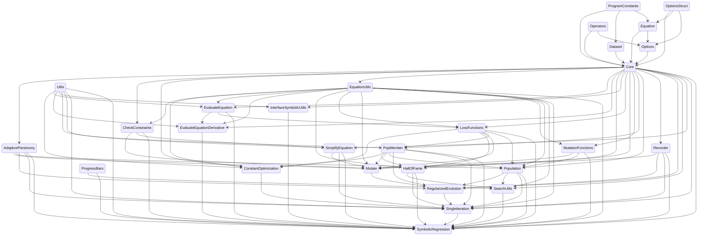

# SymbolicRegression.jl

| Latest release | Documentation | Build status | Coverage |
| --- | --- | --- | --- |
| [](https://juliahub.com/ui/Packages/SymbolicRegression/X2eIS) | [](https://astroautomata.com/SymbolicRegression.jl/dev/) [](https://astroautomata.com/SymbolicRegression.jl/stable/)  | [](.github/workflows/CI.yml) | [](https://coveralls.io/github/MilesCranmer/SymbolicRegression.jl?branch=master) |

Distributed High-Performance symbolic regression in Julia.

Check out [PySR](https://github.com/MilesCranmer/PySR) for
a Python frontend.

 

[Cite this software](https://github.com/MilesCranmer/PySR/blob/master/CITATION.md)

# Quickstart

Install in Julia with:
```julia
using Pkg
Pkg.add("SymbolicRegression")
```

The heart of this package is the
`EquationSearch` function, which takes
a 2D array (shape [features, rows]) and attempts
to model a 1D array (shape [rows])
using analytic functional forms.

Run distributed on four processes with:
```julia
using SymbolicRegression

X = randn(Float32, 5, 100)
y = 2 * cos.(X[4, :]) + X[1, :] .^ 2 .- 2

options = SymbolicRegression.Options(
    binary_operators=(+, *, /, -),
    unary_operators=(cos, exp),
    npopulations=20
)

hall_of_fame = EquationSearch(X, y, niterations=40, options=options, numprocs=4)
```
You can view the resultant equations in the dominating Pareto front (best expression
seen at each complexity) with:
```julia
dominating = calculate_pareto_frontier(X, y, hall_of_fame, options)
```
This is a vector of `PopMember` type - which contains the expression along with the score.
We can get the expressions with:
```julia
trees = [member.tree for member in dominating]
```
Each of these equations is a `Node{T}` type for some constant type `T` (like `Float32`).

You can evaluate a given tree with:
```julia
tree = trees[end]
output, did_succeed = eval_tree_array(tree, X, options)
```
The `output` array will contain the result of the tree at each of the 100 rows.
This `did_succeed` flag detects whether an evaluation was successful, or whether
encountered any NaNs or Infs during calculation (such as, e.g., `sqrt(-1)`).


## Constructing trees

You can also manipulate and construct trees directly. For example:

```julia
using SymbolicRegression

options = Options(;
    binary_operators=(+, -, *, ^, /), unary_operators=(cos, exp, sin)
)
x1, x2, x3 = Node("x1"), Node("x2"), Node("x3")
tree = cos(x1 - 3.2 * x2) - x1^3.2
```
This tree has `Float64` constants, so the type of the entire tree
will be promoted to `Node{Float64}`.

We can convert all constants (recursively) to `Float32`:
```julia
float32_tree = convert(Node{Float32}, tree)
```
We can then evaluate this tree on a dataset:
```julia
X = rand(Float32, 3, 100)
output, did_succeed = eval_tree_array(tree, X, options)
```

## Exporting to SymbolicUtils.jl

We can view the equations in the dominating
Pareto frontier with:
```julia
dominating = calculate_pareto_frontier(X, y, hall_of_fame, options)
```
We can convert the best equation
to [SymbolicUtils.jl](https://github.com/JuliaSymbolics/SymbolicUtils.jl)
with the following function:
```julia
eqn = node_to_symbolic(dominating[end].tree, options)
println(simplify(eqn*5 + 3))
```

We can also print out the full pareto frontier like so:
```julia
println("Complexity\tMSE\tEquation")

for member in dominating
    complexity = compute_complexity(member.tree, options)
    loss = member.loss
    string = string_tree(member.tree, options)

    println("$(complexity)\t$(loss)\t$(string)")
end
```

# Code structure

The dependency structure is as follows:




Bash command to generate dependency structure from `src` directory (requires `vim-stream`):
```bash
echo 'stateDiagram-v2'
IFS=$'\n'
for f in *.jl; do
    for line in $(cat $f | grep -e 'import \.\.' -e 'import \.'); do
        echo $(echo $line | vims -s 'dwf:d$' -t '%s/^\.*//g' '%s/Module//g') $(basename "$f" .jl);
    done;
done | vims -l 'f a--> ' | sort
```


## Search options

See https://astroautomata.com/SymbolicRegression.jl/stable/api/#Options

