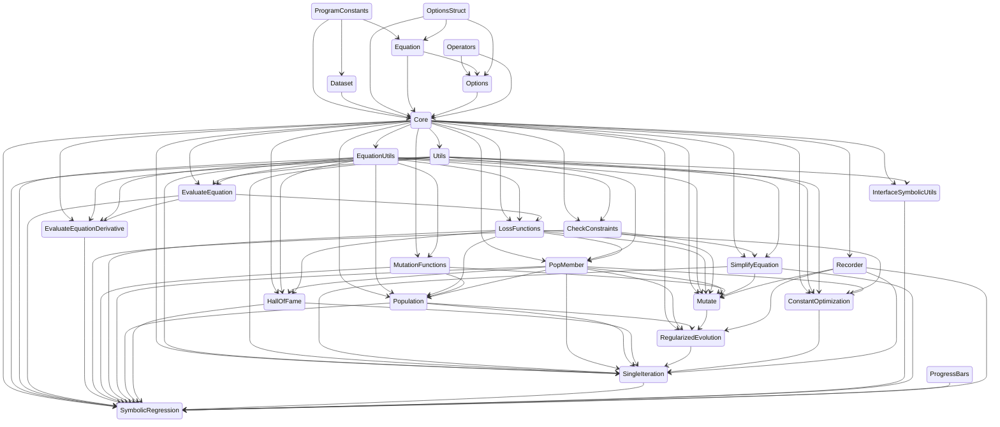

If you are looking for the main loop, start with `function _EquationSearch` in `SymbolicRegression.jl`. You can proceed from there.
All functions are imported at the top using `import {filename}Module` syntax, which should help you navigate the codebase.

The dependency structure is as follows:




Bash command to generate dependency structure from `src` directory (requires `vim-stream`):
```bash
echo 'stateDiagram-v2'
IFS=$'\n'
for f in *.jl; do
    for line in $(cat $f | grep -e 'import \.\.' -e 'import \.'); do
        echo $(echo $line | vims -s 'dwf:d$' -t '%s/^\.*//g' '%s/Module//g') $(basename "$f" .jl);
    done;
done | vims -l 'f a-->
```
